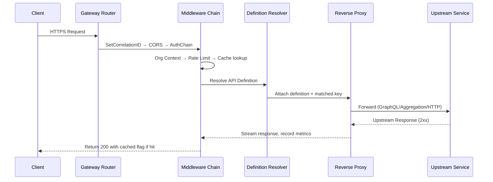
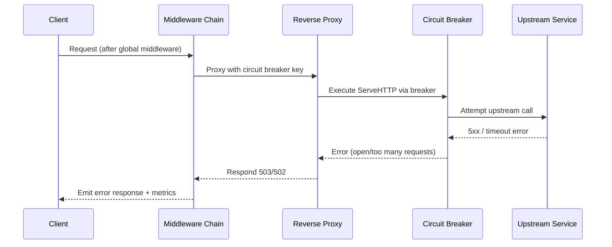
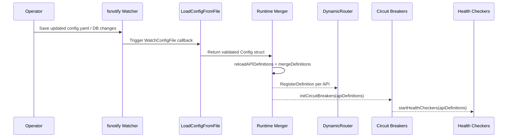

{/* imported from repo/docs/02-Architecture.md; review for secrets/PII before publishing */}

**Runtime Overview**
- Gateway stands up a mux router on the HTTP side while sharing the listener with a gRPC server via `cmux`, then launches graceful shutdown handlers for both protocols.^main.go:1820^main.go:2113^main.go:2131^
- The router applies correlation IDs, CORS, OAuth2, mTLS, JWT, API-Key, org context, rate limiting, and response caching before delegating to controllers or the proxy fallback.^main.go:1843^main.go:1870^main.go:1899^main.go:1920^main.go:1925^
- Definition resolution snapshots in-memory API definitions under a read lock so proxy decisions remain zero-copy and concurrency-safe.^middleware/definition_resolution.go:26^middleware/definition_resolution.go:42^
- Services interact with Redis, PostgreSQL, and Consul through repositories and a dynamic routing layer that tracks weighted, versioned endpoints.^main.go:1238^main.go:1322^internal/routing/dynamic_router.go:66^internal/routing/dynamic_router.go:219^

```mermaid
graph TD
    User[Admin Console User] --> NextJS[Next.js Admin Console]
    NextJS -->|REST /admin| GatewayHTTP[Go HTTP Server]
    GatewayHTTP --> MiddlewareStack[Correlation + CORS + Auth Chain + OrgCtx + RateLimit + Cache]
    GatewayHTTP --> cmux[cmux Listener]
    cmux --> HTTPListener[HTTP Listener]
    cmux --> GRPCListener[gRPC Listener]
    MiddlewareStack --> Controllers[Controllers (Org/Admin/RBAC/Observability)]
    MiddlewareStack --> ProxyFallback[Definition Resolution + Reverse Proxy]
    Controllers --> Services[Domain Services]
    ProxyFallback --> Services
    Services --> Repos[GORM / Repositories]
    Repos --> Postgres[(PostgreSQL)]
    Services --> Redis[(Redis Cache)]
    Services --> Consul[(Consul Service Discovery)]
    GatewayHTTP --> Prometheus[(Prometheus Metrics)]
    GatewayHTTP --> OTel[OTel Tracer → Jaeger]
```

- HTTP+gRPC sharing and graceful orchestration come from `cmux` setup that splits traffic and starts dedicated goroutines.^main.go:2119^main.go:2142^main.go:2156^
- Middleware stack order and composition is explicit in `main.go`, ensuring auth, org context, rate limiting, and caching precede handlers.^main.go:1843^main.go:1870^main.go:1890^main.go:1925^
- Controllers stitch to services which re-use Redis, Consul, and database repositories for stateful operations.^main.go:1397^main.go:1663^main.go:1674^
- Metrics and tracing exporters initialize during startup, binding Prometheus counters and Jaeger spans.^main.go:299^main.go:207^

**Request Sequence (200)**



The happy-path sequence is implemented by the middleware sequence (`SetCorrelationIDHeaderMiddleware`, CORS, auth factory, org context, rate limiter, caching) before the definition resolver hands off to the proxy which selects transport-specific handling.^main.go:1843^main.go:1870^main.go:1899^main.go:1925^main.go:2028^main.go:2280^main.go:2289^main.go:2310^main.go:2359^

**Request Sequence (5xx / Circuit Breaker)**



When upstream errors occur, the proxy wraps the handler in `gobreaker`, turning repeated failures into `503` or `502` responses and recording breaker metrics before returning to the caller.^main.go:2359^main.go:2363^main.go:2396^main.go:2401^main.go:2408^main.go:2418^

**Control Plane Sequence**



- `WatchConfigFile` reacts to file writes and reloads configuration via `LoadConfigFromFile`, invoking the refresh callback when YAML is valid.^config/config.go:602^config/config.go:651^
- The callback rebuilds API definitions from config, merges them with database copies, and swaps the global slice under a write lock.^main.go:1572^main.go:1766^main.go:1771^
- Every reload re-registers dynamic router entries and refreshes circuit breakers, keeping the runtime aligned with Consul topology and health tickers.^main.go:2089^internal/routing/dynamic_router.go:87^main.go:313^main.go:460^

**Control Plane & Runtime Loops**
- Combined database + config API definitions are merged, cached, and registered with the dynamic router at boot and during admin-triggered reloads.^main.go:1717^main.go:1741^main.go:1754^main.go:1778^
- Consul and Redis are initialized with env overrides, and background goroutines watch config files and health check upstream endpoints to keep routing data fresh.^main.go:1240^main.go:1255^main.go:1285^main.go:2048^main.go:460^
- The dynamic router maintains cached Consul results, weighted/round-robin selection, and exposes topology snapshots to the observability service.^internal/routing/dynamic_router.go:66^internal/routing/dynamic_router.go:102^internal/routing/dynamic_router.go:224^services/observability_service.go:112^
- gRPC proxying reuses the same infrastructure, applying circuit breaker interceptors and connection pooling for upstream services.^main.go:3701^main.go:3713^main.go:3747^
